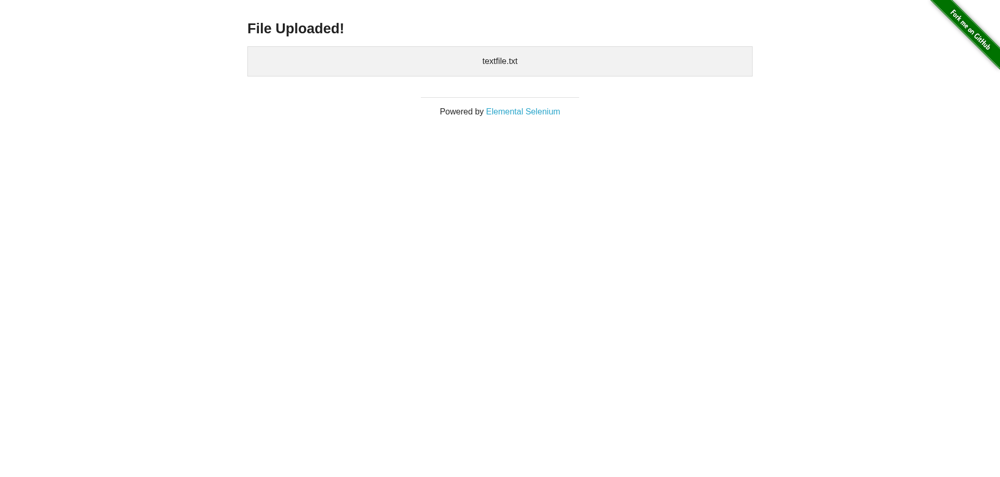

# Python Web Scraping & Testing (Selenium + pytest)

[](https://github.com/nupolovykh/QA-web-labprojects-python/actions/workflows/ci.yml)

> ⏹️ **Archived Coursework** — Selenium & pytest labs from a university software-testing course

A progression of labs on web-scraping and automated testing in Python: Selenium
basics and page interactions, pytest fundamentals (asserts, parametrization,
fixtures, class-based tests), CI/CD integration, FastAPI + pytest API testing,
HTML test reporting, Locust load testing, and the Page Object Model pattern.

**Tech stack:** Python, Selenium, pytest, FastAPI, Uvicorn, Locust

## Labs

| Lab | Topic | Location | Preview |
|---|---|---|---|
| 1-3 | Selenium basics: scraping python.org | [`lab01-03/`](lab01-03) | |
| 4 | Scraping VK video listings | [`lab04/`](lab04) | |
| 5 | Scraping ci.nsu.ru news with a date filter | [`lab05/`](lab05) | |
| 6 | Context menus and file upload | [`lab06/`](lab06) |  |
| 7 | Multi-tab/window handling | [`lab07/`](lab07) | |
| 8 | Explicit waits + Google Translate automation | [`lab08/`](lab08) | |
| 9 | pytest basics: plain asserts | [`lab09/`](lab09) | |
| 10 | pytest parametrize + fixtures | [`lab10/`](lab10) | |
| 11 | pytest + CI (GitHub Actions & Jenkins) | [`lab11/`](lab11) | |
| 12 | FastAPI + Uvicorn API, tested with pytest | [`lab12/`](lab12) | |
| 13 | pytest-html reporting & Locust load testing | [`lab13/`](lab13) | |
| 14 | Page Object Model with Selenium + pytest | [`lab14/`](lab14) | |

*Only `lab06` has a captured screenshot — it's the one real one the original
coursework run produced. The rest of the Selenium labs scrape live external
sites, and this repo's automation doesn't run them to generate previews.*

## Install & run

```bash
pip install -r requirements.txt
```

ChromeDriver is managed automatically by [`webdriver-manager`](https://pypi.org/project/webdriver-manager/) —
no manual driver download or path setup needed. Each lab is a standalone
script or pytest suite; run a Selenium lab directly, e.g.:

```bash
python lab01-03/python-parsing.py
```

or run a lab's tests with pytest, e.g.:

```bash
cd lab09 && pytest
```

Some labs (`lab11`, `lab12`) also ship their own `requirements.txt` for a
minimal, lab-scoped install.

## Documentation

- [Selenium for Python docs](https://selenium-python.readthedocs.io/)
- [pytest docs](https://docs.pytest.org/en/stable/getting-started.html)
- [Selenium + Python questions on Stack Overflow](https://stackoverflow.com/search?q=%5Bpython%5D+and+%5Bselenium%5D)
